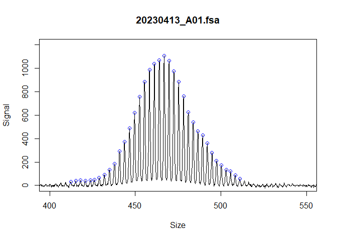
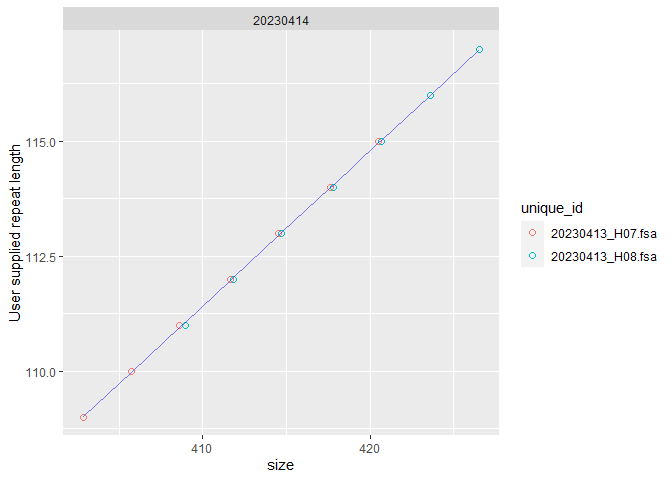
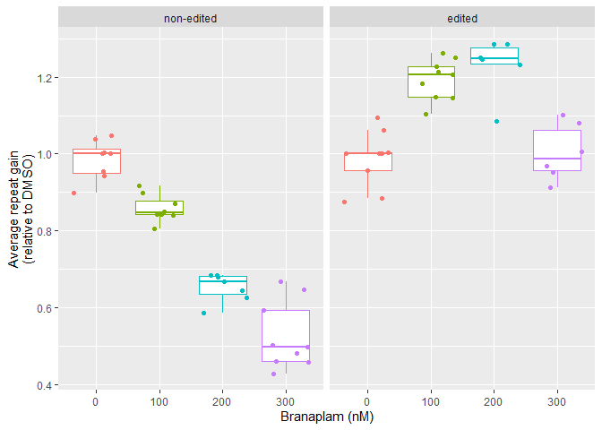

# instability

The goal of instability is to provide a pipeline for short tandem repeat
instability analysis from fragment analysis data. This package takes
inputs of peak tables, usually from Genemapper5 software, and a user
supplied metadata data-frame. The package identifies the modal peaks,
calls repeats, then calculates repeat instability metrics (ie expansion
index or average repeat gain).

In this package, each sample is represented by an R6 ‘fragments’ object,
which are organised in lists. As a user there are accessor functions
that iterate over these lists, so you shouldn’t need to interact with
the fragments object.

We are working on a full pipeline for also processing the raw .fsa
files. Alternatively, the
[Fragman](https://cran.r-project.org/web/packages/Fragman/index.html)
package can be used to process the .fsa files if you do not have access
to Genemapper (see here for a vignette on using Fragman with this
package). We usually only use Genemapper to convert the raw signal to bp
size from the ladder and identify the peaks, all of which works well and
is automated in the software.

There are several important factors to a successful repeat instability
experiment that this package helps with:

- Each sample has a unique id, usually the file name

- An appropriate baseline control for your experiment. For example, the
  tail of a mouse or a sample at the start of a time-course experiment.
  This is indicated with a `TRUE` in the `metrics_baseline_control`
  column of the metadata.

- Samples of known repeat length to correct across fragment analysis
  runs. There are slight fluctuations of repeat length size across runs,
  so if samples are to be compared for different runs you must correct
  the repeat length so they are comparable. This is usually achieved by
  running running positive control samples with a known validated repeat
  size of the modal peak in each fragment analysis run. These samples
  are then indicated `TRUE` in the column `repeat_positive_control_TF`
  in the metadata, and the known repeat length of the modal peak given
  in the `repeat_positive_control_length` column.

## Installation

You can install the development version of instability from
[GitHub](https://github.com/zachariahmclean/instability) with:

``` r
# install.packages("devtools")
devtools::install_github("zachariahmclean/instability")
```

## Example

``` r
library(instability)
library(tidyverse)
```

## Import data

Read in the raw data and the metadata. In this case we will used example
data within this package, but usually this would be either raw
genemapper output or a peak table from another source (e.g. the Fragman
R package)

``` r
gm_raw <- instability::example_data
metadata <- instability::metadata
```

The raw data are coerced into a list of ‘fragments’ class, which is a
fundamental data structure used in this pipeline.

``` r


  test_fragments <- peak_table_to_fragments(gm_raw,
                                            data_format = "genemapper5",
                                            dye_channel = "B",
                                            min_size_bp = 400)
```

## Add metadata

Metadata can be incorporated to enhance the fragments class and allow
additional functionality in the `call_repeats()` and
`calculate_instability_metrics()` functions. You have to match up the
column name in the metadata dataframe with the corresponding parameter
in `add_metadata()`.

``` r
    test_metadata <- add_metadata(
      fragments_list = test_fragments,
      metadata_data.frame = metadata,
      unique_id = "unique_id",
      plate_id = "plate_id",
      sample_group_id = "cell_line",
      metrics_baseline_control = "metrics_baseline_control_TF",
      repeat_positive_control_TF = "repeat_positive_control_TF",
      repeat_positive_control_length = "repeat_positive_control_length")
```

# Identify modal peaks and call repeats

Next we identify the modal peaks with `find_alleles()` and convert the
base pair level data to repeats with `call_repeats(`).

``` r
test_alleles <- find_alleles(
      fragments_list = test_metadata,
      number_of_peaks_to_return = 1)


test_repeats <- call_repeats(
      fragments_list = test_alleles,
      repeat_length_correction = "from_metadata"
    )
```

We can view the distribution of repeat sizes and the identified modal
peak (dot) with a plotting function.

``` r

plot_fragments(test_repeats,
               names(test_repeats)[1:9])
```



We can also view the data used to generate the model for calling the
repeat size when we indicate size standard samples in the metadata and
have `repeat_length_correction = "from_metadata"` in `call_repeats()`.

``` r

plot_repeat_correction_model(test_repeats)
```



In this case the dots are basically overlapping and in the middle of the
linear model, indicating that we have correctly identified the known
tallest peak used for the size standards. If the wrong peak was selected
for one of the samples, the dots would be shifted across 3 bp and no
longer overlapping.

## Calculate instability metrics

Finally, the repeat instability metrics can be calculated. In the
metadata, a subset of the samples are set as ‘metrics_baseline_control’,
meaning they are the samples taken at day 0 in this experiment and are
the control samples are compared to. This allows us to set
`grouped = TRUE` and set the index peak (the repeat size at the start of
the experiment, or inherited repeat length in the case of mice) for the
expansion index and other metrics.

``` r
test_metrics_grouped <- calculate_instability_metrics(
      fragments_list = test_repeats,
      grouped = TRUE,
      peak_threshold = 0.05,
      window_around_main_peak = c(-40, 40))
```

These metrics can then be used to quantify repeat instability. For
example, this reproduces Figure 7e of [our
manuscript](https://www.biorxiv.org/content/10.1101/2023.07.25.550489v1).

First, prepare the data for plotting by removing poor quality samples
and finding the average repeat gain relative to the DMSO group for each
cell line

``` r
plot_data <- test_metrics_grouped |>
    dplyr::left_join(metadata) |>
    dplyr::filter(day >0,
           modal_peak_height > 500) |>
    dplyr::group_by(cell_line) |>
    dplyr::mutate(rel_gain = average_repeat_gain / median(average_repeat_gain[which(treatment == 0)]),
                  genotype = forcats::fct_rev(genotype))
#> Joining with `by = join_by(unique_id)`
```

Then we can plot the instability metrics

``` r
ggplot(plot_data,
       aes(as.factor(treatment), rel_gain,
           colour = as.factor(treatment))) +
  geom_boxplot(outlier.shape = NA) +
  geom_jitter() +
  facet_wrap(vars(genotype)) +
  labs(y = "Average repeat gain\n(relative to DMSO)",
       x = "Branaplam (nM)") +
  theme(legend.position = "none")
```


>>>>>>> c0c68c0c42ce17a3f9d55549cb0bb4ae9419e0e8
