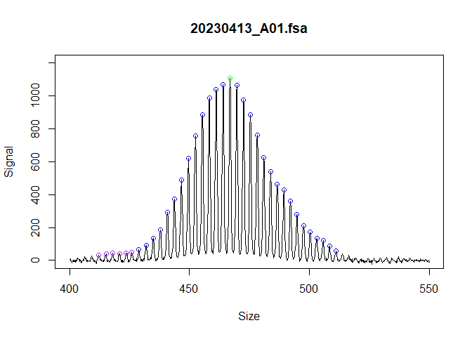
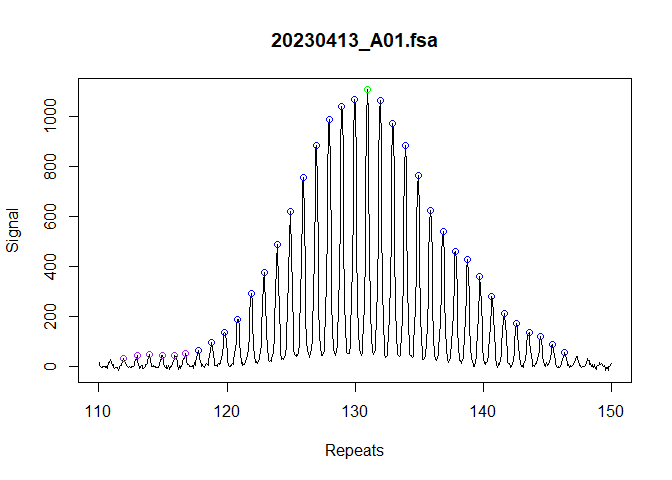
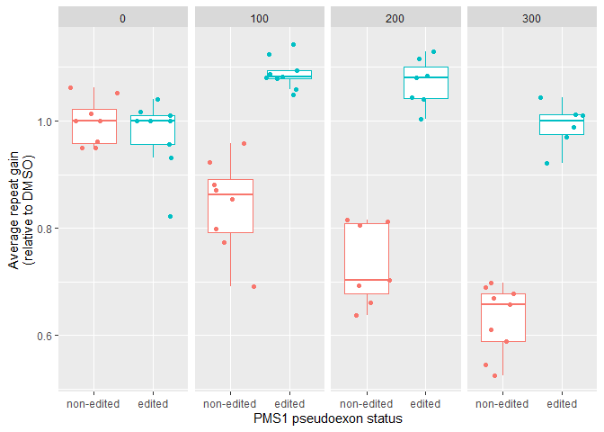

# instability package

This package provides a pipeline for short tandem repeat instability
analysis from fragment analysis data. The inputs are fsa files or peak
tables (eg Genemapper5 software output), and a user supplied metadata
data-frame. The functions identify ladders, calls peaks, and calculates
repeat instability metrics (ie expansion index or average repeat gain).

To report bugs or feature requests, please visit the Github issue
tracker [here](https://github.com/zachariahmclean/instability/issues).
For assistance or any other inquires, contact [Zach
McLean](mailto:zmclean@mgh.harvard.edu?subject=%5BGitHub%5D%20Source%20Han%20Sans).

If you use this package, please cite
[this](https://www.nature.com/articles/s41467-024-47485-0) paper for
now.

## How to use the package

In this package, each sample is represented by an R6 ‘fragments’ object,
which are organised in lists. As a user, there are accessor functions
that iterate over these lists, so you shouldn’t need to interact with
the fragments object. However, if you do, the attributes of the objects
can be accessed with “\$”.

There are several important factors to a successful repeat instability
experiment and things to consider when using this package:

- Each sample has a unique id, usually the file name

- Use of an appropriate baseline control for your experiment. For
  example, the tail of a mouse or a sample at the start of a time-course
  experiment. This is indicated with a `TRUE` in the
  `metrics_baseline_control` column of the metadata.

- Use of samples of known repeat length to correct across fragment
  analysis runs. There are slight fluctuations of repeat length size
  across runs, so if samples are to be analyzed for different runs you
  must correct the repeat length so they are comparable. This is usually
  achieved by running running positive control samples with a known
  validated repeat size of the modal peak in each fragment analysis run.
  These samples are then indicated `TRUE` in the column `size_standard`
  in the metadata, and the known repeat length of the modal peak given
  in the `size_standard_repeat_length` column.

- If starting from fsa files, the GeneScan™ 1200 LIZ™ dye Size Standard
  ladder assignment may not work very well. The ladder identification
  algorithm is optimized for GeneScan™ 500 LIZ™ or GeneScan™ 600 LIZ™.
  The 1200 LIZ™ ladder has an extremely challenging pattern of ladder
  peaks to automatically assign. However, these ladders can be fixed
  manually with the `fix_ladders_interactive()` app.

## Installation

You can install the development version of instability from
[GitHub](https://github.com/zachariahmclean/instability) with:

``` r
# install.packages("devtools")
devtools::install_github("zachariahmclean/instability")
```

## Example

``` r
library(instability)
library(dplyr)
library(ggplot2)
```

## Import data

First, we read in the raw data. In this case we will used example data
within this package, but usually this would be either be fsa files that
are read in using instability::read_fsa(), raw genemapper output or a
peak table from another source (e.g. the Fragman R package)

``` r
fsa_raw <- instability::cell_line_fsa_list
```

## Find ladders

The raw data are coerced into a list of ‘fragments’ class objects, which
is a fundamental data structure used in this pipeline. The ‘fragments’
class objects are R6 classes, so the individual elements can be accesses
with “\$”.

First we find the ladders and call bp size in the fsa file. The bp is
assigned using the local Southern method. Basically, for each data
point, linear models are made for the lower and upper 3 size standard
and the predicted sizes are averaged.

``` r
ladder_list <- find_ladders(cell_line_fsa_list,
  ladder_channel = "DATA.105",
  signal_channel = "DATA.1"
)
#>   |                                                                              |                                                                      |   0%  |                                                                              |=                                                                     |   1%  |                                                                              |                                                                      |   0%  |                                                                              |==                                                                    |   2%  |                                                                              |                                                                      |   0%  |                                                                              |==                                                                    |   3%  |                                                                              |                                                                      |   0%  |                                                                              |===                                                                   |   4%  |                                                                              |                                                                      |   0%  |                                                                              |====                                                                  |   5%  |                                                                              |                                                                      |   0%  |                                                                              |=====                                                                 |   7%  |                                                                              |                                                                      |   0%  |                                                                              |=====                                                                 |   8%  |                                                                              |                                                                      |   0%  |                                                                              |======                                                                |   9%  |                                                                              |                                                                      |   0%  |                                                                              |=======                                                               |  10%  |                                                                              |                                                                      |   0%  |                                                                              |========                                                              |  11%  |                                                                              |                                                                      |   0%  |                                                                              |========                                                              |  12%  |                                                                              |                                                                      |   0%  |                                                                              |=========                                                             |  13%  |                                                                              |                                                                      |   0%  |                                                                              |==========                                                            |  14%  |                                                                              |                                                                      |   0%  |                                                                              |===========                                                           |  15%  |                                                                              |                                                                      |   0%  |                                                                              |===========                                                           |  16%  |                                                                              |                                                                      |   0%  |                                                                              |============                                                          |  17%  |                                                                              |                                                                      |   0%  |                                                                              |=============                                                         |  18%  |                                                                              |                                                                      |   0%  |                                                                              |==============                                                        |  20%  |                                                                              |                                                                      |   0%  |                                                                              |==============                                                        |  21%  |                                                                              |                                                                      |   0%  |                                                                              |===============                                                       |  22%  |                                                                              |                                                                      |   0%  |                                                                              |================                                                      |  23%  |                                                                              |                                                                      |   0%  |                                                                              |=================                                                     |  24%  |                                                                              |                                                                      |   0%  |                                                                              |==================                                                    |  25%  |                                                                              |                                                                      |   0%  |                                                                              |==================                                                    |  26%  |                                                                              |                                                                      |   0%  |                                                                              |===================                                                   |  27%  |                                                                              |                                                                      |   0%  |                                                                              |====================                                                  |  28%  |                                                                              |                                                                      |   0%  |                                                                              |=====================                                                 |  29%  |                                                                              |                                                                      |   0%  |                                                                              |=====================                                                 |  30%  |                                                                              |                                                                      |   0%  |                                                                              |======================                                                |  32%  |                                                                              |                                                                      |   0%  |                                                                              |=======================                                               |  33%  |                                                                              |                                                                      |   0%  |                                                                              |========================                                              |  34%  |                                                                              |                                                                      |   0%  |                                                                              |========================                                              |  35%  |                                                                              |                                                                      |   0%  |                                                                              |=========================                                             |  36%  |                                                                              |                                                                      |   0%  |                                                                              |==========================                                            |  37%  |                                                                              |                                                                      |   0%  |                                                                              |===========================                                           |  38%  |                                                                              |                                                                      |   0%  |                                                                              |===========================                                           |  39%  |                                                                              |                                                                      |   0%  |                                                                              |============================                                          |  40%  |                                                                              |                                                                      |   0%  |                                                                              |=============================                                         |  41%  |                                                                              |                                                                      |   0%  |                                                                              |==============================                                        |  42%  |                                                                              |                                                                      |   0%  |                                                                              |==============================                                        |  43%  |                                                                              |                                                                      |   0%  |                                                                              |===============================                                       |  45%  |                                                                              |                                                                      |   0%  |                                                                              |================================                                      |  46%  |                                                                              |                                                                      |   0%  |                                                                              |=================================                                     |  47%  |                                                                              |                                                                      |   0%  |                                                                              |=================================                                     |  48%  |                                                                              |                                                                      |   0%  |                                                                              |==================================                                    |  49%  |                                                                              |                                                                      |   0%  |                                                                              |===================================                                   |  50%  |                                                                              |                                                                      |   0%  |                                                                              |====================================                                  |  51%  |                                                                              |                                                                      |   0%  |                                                                              |=====================================                                 |  52%  |                                                                              |                                                                      |   0%  |                                                                              |=====================================                                 |  53%  |                                                                              |                                                                      |   0%  |                                                                              |======================================                                |  54%  |                                                                              |                                                                      |   0%  |                                                                              |=======================================                               |  55%  |                                                                              |                                                                      |   0%  |                                                                              |========================================                              |  57%  |                                                                              |                                                                      |   0%  |                                                                              |========================================                              |  58%  |                                                                              |                                                                      |   0%  |                                                                              |=========================================                             |  59%  |                                                                              |                                                                      |   0%  |                                                                              |==========================================                            |  60%  |                                                                              |                                                                      |   0%  |                                                                              |===========================================                           |  61%  |                                                                              |                                                                      |   0%  |                                                                              |===========================================                           |  62%  |                                                                              |                                                                      |   0%  |                                                                              |============================================                          |  63%  |                                                                              |                                                                      |   0%  |                                                                              |=============================================                         |  64%  |                                                                              |                                                                      |   0%  |                                                                              |==============================================                        |  65%  |                                                                              |                                                                      |   0%  |                                                                              |==============================================                        |  66%  |                                                                              |                                                                      |   0%  |                                                                              |===============================================                       |  67%  |                                                                              |                                                                      |   0%  |                                                                              |================================================                      |  68%  |                                                                              |                                                                      |   0%  |                                                                              |=================================================                     |  70%  |                                                                              |                                                                      |   0%  |                                                                              |=================================================                     |  71%  |                                                                              |                                                                      |   0%  |                                                                              |==================================================                    |  72%  |                                                                              |                                                                      |   0%  |                                                                              |===================================================                   |  73%  |                                                                              |                                                                      |   0%  |                                                                              |====================================================                  |  74%  |                                                                              |                                                                      |   0%  |                                                                              |====================================================                  |  75%  |                                                                              |                                                                      |   0%  |                                                                              |=====================================================                 |  76%  |                                                                              |                                                                      |   0%  |                                                                              |======================================================                |  77%  |                                                                              |                                                                      |   0%  |                                                                              |=======================================================               |  78%  |                                                                              |                                                                      |   0%  |                                                                              |========================================================              |  79%  |                                                                              |                                                                      |   0%  |                                                                              |========================================================              |  80%  |                                                                              |                                                                      |   0%  |                                                                              |=========================================================             |  82%  |                                                                              |                                                                      |   0%  |                                                                              |==========================================================            |  83%  |                                                                              |                                                                      |   0%  |                                                                              |===========================================================           |  84%  |                                                                              |                                                                      |   0%  |                                                                              |===========================================================           |  85%  |                                                                              |                                                                      |   0%  |                                                                              |============================================================          |  86%  |                                                                              |                                                                      |   0%  |                                                                              |=============================================================         |  87%  |                                                                              |                                                                      |   0%  |                                                                              |==============================================================        |  88%  |                                                                              |                                                                      |   0%  |                                                                              |==============================================================        |  89%  |                                                                              |                                                                      |   0%  |                                                                              |===============================================================       |  90%  |                                                                              |                                                                      |   0%  |                                                                              |================================================================      |  91%  |                                                                              |                                                                      |   0%  |                                                                              |=================================================================     |  92%  |                                                                              |                                                                      |   0%  |                                                                              |=================================================================     |  93%  |                                                                              |                                                                      |   0%  |                                                                              |==================================================================    |  95%  |                                                                              |                                                                      |   0%  |                                                                              |===================================================================   |  96%  |                                                                              |                                                                      |   0%  |                                                                              |====================================================================  |  97%  |                                                                              |                                                                      |   0%  |                                                                              |====================================================================  |  98%  |                                                                              |                                                                      |   0%  |                                                                              |===================================================================== |  99%  |                                                                              |                                                                      |   0%  |                                                                              |======================================================================| 100%
```

visually inspect each ladder to make sure that the ladders were
correctly assigned

``` r
plot_ladders(ladder_list[1],
  n_facet_col = 1,
  xlim = c(1000, 4800),
  ylim = c(0, 15000)
)
```


If the ladders are are not assigned correctly, you can either try
fix_ladders_auto() (optimal for when just a single ladder peak is
wrong), or manually using the fix_ladders_interactive() app.


## Find fragments

The fragment peaks are identified in the raw continuous trace data.

``` r
peak_list <- find_fragments(ladder_list,
  min_bp_size = 300
)
```

Visually inspect the traces and called peaks to make sure they were
correctly assigned.

``` r
plot_traces(peak_list[1],
  n_facet_col = 1,
  xlim = c(400, 550),
  ylim = c(0, 1200)
)
```



Alternatively, if not starting from fsa files, this is where you would
use exported data from Genemapper if you would rather use the Genemapper
bp sizing and peak identification algorithms.

``` r
peak_list_genemapper <- peak_table_to_fragments(instability::example_data,
  data_format = "genemapper5",
  dye_channel = "B",
  min_size_bp = 300
)
```

## Add metadata

Metadata can be incorporated to enhance the fragments class and allow
additional functionality in the `call_repeats()` (correcting repeat
length across fragment analysis runs) and
`calculate_instability_metrics()` (calculating expansion index or
average repeat gain) functions. Some of the metadata fields are optional
but highly recommended. Prepare a file (eg spreadsheet saved as .csv)
with the following columns. If you use the specified column names, it
will be automatically parsed by `add_metadata()`, otherwise you will
need to match up which column name belongs to which metadata category
(as done below in `add_metadata()`):

Metadata table column \| Description \|

\|————-\|———————————————————–\| \| unique_id \| The unique identifier
for the fsa file. Usually the sample file name. This must be unique,
including across runs. \| \| group_id \| This groups the samples for
instability metric calclations. Provide a group id value for each
sample. For example, in a mouse experiment and using the expansion
index, you need to group the samples since they have the same metrics
baseline control (eg inherited repeat length), so provide the mouse id.
\| \| metrics_baseline_control \| This is related to group_id. Indicate
with ‘TRUE’ to specify which sample is the baseline control (eg mouse
tail for inherited repeat length, or day-zero sample in cell line
experiments) \| \| plate_id \| This groups the samples for correcting
the repeat length. Provide a value for each fragment analysis run (eg
date). \| \| size_standard \| This is related to plate_id. Indicate with
‘TRUE’ to specify which sample is the size standard of the repeat
length. \| \| size_standard_repeat_length \| This is related to
size_standard. If the sample is a size standard, provide a numeric value
of the modal repeat length. \|

``` r
metadata <- instability::metadata

metadata_added_list <- add_metadata(
  fragments_list = peak_list,
  metadata_data.frame = metadata,
  unique_id = "unique_id",
  group_id = "cell_line",
  metrics_baseline_control = "metrics_baseline_control_TF",
  plate_id = "plate_id",
  size_standard = "repeat_positive_control_TF",
  size_standard_repeat_length = "repeat_positive_control_length"
)
```

# Identify modal peaks and call repeats

Next we identify the modal peaks with `find_alleles()` and convert the
base pair fragments to repeats with `call_repeats(`).

``` r
alleles_list <- find_alleles(
  fragments_list = metadata_added_list,
  number_of_peaks_to_return = 1
)


repeats_list <- call_repeats(
  fragments_list = alleles_list,
  repeat_length_correction = "from_metadata"
)
```

We can view the distribution of repeat sizes and the identified modal
peak with a plotting function.

``` r
plot_fragments(repeats_list[1], n_facet_col = 1)
```



We can also view the data used to generate the model for calling the
repeat size when we indicate size standard samples in the metadata and
have `repeat_length_correction = "from_metadata"` in `call_repeats()`.

``` r
plot_repeat_correction_model(repeats_list)
```


In this case the dots are basically overlapping and in the middle of the
linear model, indicating that we have correctly identified the known
tallest peak used for the repeat size standards. If the wrong peak was
selected for one of the samples, the dots would be shifted across 3 bp
and no longer overlapping.

## Calculate instability metrics

Finally, the repeat instability metrics can be calculated. In the
metadata, a subset of the samples are set as ‘metrics_baseline_control’,
meaning they are the samples taken at day 0 in this experiment. This
allows us to set `grouped = TRUE` and set the index peak (the modal
repeat size at the start of the experiment, or inherited repeat length
in the case of mice) for the expansion index and other metrics.

``` r
metrics_grouped_df <- calculate_instability_metrics(
  fragments_list = repeats_list,
  grouped = TRUE,
  peak_threshold = 0.05
)
```

These metrics can then be used to quantify repeat instability. For
example, this reproduces Figure 7e of [our
manuscript](https://www.nature.com/articles/s41467-024-47485-0).

First, prepare the data for plotting by removing poor quality samples
and finding the average repeat gain relative to the DMSO group for each
cell line

``` r
plot_data <- metrics_grouped_df |>
  dplyr::left_join(metadata, by = dplyr::join_by(unique_id)) |>
  dplyr::filter(
    day > 0,
    modal_peak_height > 500
  ) |>
  dplyr::group_by(cell_line) |>
  dplyr::mutate(
    rel_gain = average_repeat_gain / median(average_repeat_gain[which(treatment == 0)]),
    genotype = forcats::fct_rev(genotype)
  )
```

Then we can plot the instability metrics

``` r
ggplot(
  plot_data,
  aes(genotype, rel_gain, colour = genotype)
) +
  geom_boxplot(outlier.shape = NA) +
  geom_jitter() +
  facet_wrap(vars(as.factor(treatment)), nrow = 1) +
  labs(
    y = "Average repeat gain\n(relative to DMSO)",
    x = "PMS1 pseudoexon status"
  ) +
  theme(legend.position = "none")
```


